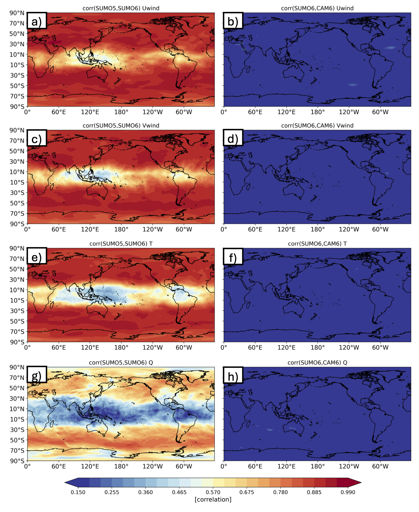

### Fig. 2. 
Anomaly correlation of model years 1979-1980 at 6 hourly averaged timesteps for the CAM5 and CAM6 SUMO runs (a,c,e,g) and the CAM6 SUMO run and an independent CAM6 run (b,d,f,h) at 200 hPa for model variables zonal wind (a,b), zonal wind (c,d), temperature (e,f), and specific humidity (g,h). Anomalies are determined by removing a 30-day centered mean at every timestep. 

# Repository to Create All Figures in:
## **_A Framework for Atmosphere Connected SuperModels_**

**Authors:**
- **Will Chapman** (NSF - NCAR) [wchapman@ucar.edu](mailto:wchapman@ucar.edu)
- **Francine Schevenhoven** (NSF - NCAR) [Francine.Schevenhoven@uib.no ](mailto:Francine.Schevenhoven@uib.no )
- **Judith Berner** (NSF - NCAR) [berner@ucar.edu](mailto:berner@ucar.edu)
- **Noel Keenlyside** (UiB - GFI)
- **Ingo Bethkee** (UiB - GFI) 
- **Ping-Gin Chiu** (UiB - GFI)
- **Alok Kumar Gupta** (UiB - GFI) 
- **Jesse Nusbaumer** (NSF - NCAR)

### File Directory Path:
To create any figure in the study please run the following notebooks: 

**Figure 02:**
- `.-|-> ./Wind_Hist.ipynb`

**Figure 03:**
- `.-|-> ./Wind_Hist.ipynb`
- 
**Figure 04:**
- `.-|-> ./Wind_Hist.ipynb`

**Figure 05:**
- `.-|-> ./Wind_Hist.ipynb`

**Figure 06:**
- `.-|-> .MOV/Modes_Bias.ipynb`
- `.-|-> .MOV/Panel_Plot.ipynb`

**Figure 07:**
- `.-|-> .Climo_U10.ipynb`

**Figure 08:**
- `.-|-> .Climo_Precip.ipynb`

**Figure 08:**
- `.-|-> .Climo_Precip.ipynb`
- `.-|-> .Climo_U10.ipynb`

### Supplemental Figures:

- `.-|-> ./Wind_Hist.ipynb`
- `.-|-> .Climo_U10.ipynb`
- `.-|-> .MOV/Modes_Bias.ipynb`
- `.-|-> .MOV/Panel_Plot.ipynb`

### Abstract

Here we present a framework that enables the first atmosphere connected supermodel using state-of-the-art atmosphere models. Versions of the Community Atmosphere Model (CAM) 5 and 6 are enabled to exchange information interactively while the models are running (a principle known as supermodeling). This innovative approach facilitates the integration of these models, allowing them to compensate for each other’s systematic errors in real time. The framework is flexible and relatively fast to integrate. We show that the models are able to synchronize, especially in dynamics driven regions. In this study we examine a single untrained super model (each model version is given equal weighting) in the combined modeling form. We show that model variability is only reduced in regions of low synchronization, and the low frequency modes of variability (NAO/PNA) are not degraded compared to the base model states. For some variables, the bias is reduced compared to both control simulations of each model version and a non-interactive ensemble.
